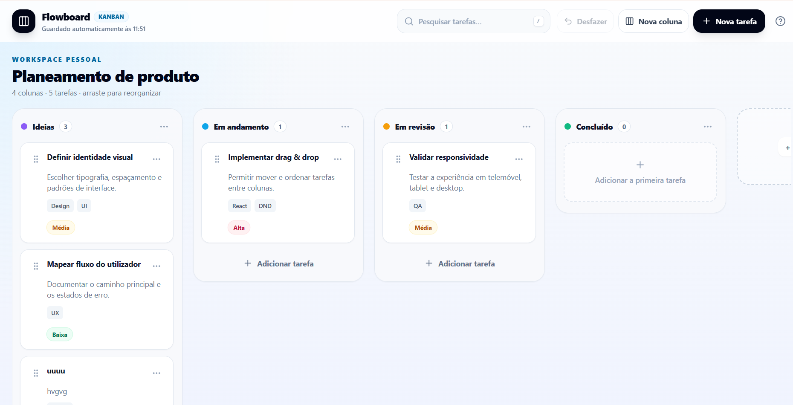

# Flowboard — Kanban / Trello Clone
<p align="center">
  
</p>
Aplicação Kanban responsiva criada com **React**, **TypeScript**, **Tailwind CSS** e **dnd-kit**. O projeto foi pensado para praticar drag & drop, estado complexo, componentização e princípios de usabilidade.

## Funcionalidades

- Criar, editar e excluir colunas
- Criar, editar e excluir tarefas
- Arrastar tarefas dentro da mesma coluna ou para outra coluna
- Reordenar tarefas
- Prioridades, etiquetas, descrição e prazo
- Pesquisa em tempo real
- Persistência automática no `LocalStorage`
- Desfazer ações com botão ou `Ctrl/ + Z`
- Confirmação antes de exclusões
- Atalhos de teclado
- Interface responsiva para telemóvel, tablet e desktop
- Acessibilidade com navegação por teclado, foco visível, mensagens `aria-live` e modal fechado com `Esc`

## Tecnologias

- React 18
- TypeScript
- Vite
- Tailwind CSS
- dnd-kit
- Lucide React

## Instalação

Requisitos: Node.js 18 ou superior.

```bash
npm install
npm run dev
```

Abra o endereço mostrado pelo Vite, normalmente:

```text
http://localhost:5173
```

## Build de produção

```bash
npm run build
npm run preview
```

## Estrutura principal

```text
src/
├── components/
│   ├── ColumnForm.tsx
│   ├── Header.tsx
│   ├── KanbanColumn.tsx
│   ├── Modal.tsx
│   ├── TaskCard.tsx
│   └── TaskForm.tsx
├── data/
│   └── defaultBoard.ts
├── hooks/
│   └── useLocalStorage.ts
├── types/
│   └── kanban.ts
├── App.tsx
├── index.css
└── main.tsx
```

## Atalhos

| Atalho | Ação |
|---|---|
| `N` | Nova tarefa |
| `C` | Nova coluna |
| `/` | Focar a pesquisa |
| `Ctrl/ + Z` | Desfazer |
| `Esc` | Fechar modal |

## Princípios de usabilidade aplicados

1. **Visibilidade do status:** estado de gravação automática e mensagens para leitores de ecrã.
2. **Correspondência com o mundo real:** colunas, tarefas, prioridades, prazos e etiquetas.
3. **Controle e liberdade:** cancelar modais, fechar com `Esc` e desfazer ações.
4. **Consistência e padrões:** botões, campos, menus e estados visuais reutilizados.
5. **Prevenção de erros:** validações, confirmação de exclusão e limites de etiquetas.
6. **Reconhecimento:** cores, ícones, etiquetas e estados visíveis.
7. **Flexibilidade:** drag & drop por rato ou teclado e atalhos para utilizadores rápidos.
8. **Minimalismo:** apenas ações essenciais ficam visíveis; opções secundárias ficam nos menus.
9. **Ajuda em erros:** mensagens explicam o problema e indicam a correção.
10. **Ajuda e documentação:** modal de ajuda dentro da aplicação e este README.

## LocalStorage

O quadro é guardado na chave:

```text
flowboard-kanban-v1
```

Para limpar manualmente os dados, abra as ferramentas do navegador e remova essa chave, ou use a opção **Restaurar exemplo** na ajuda da aplicação.
